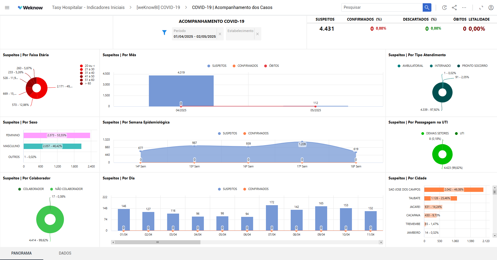

# 🏥 Hospital COVID-19 Monitoring Dashboard

> Painel estratégico para acompanhamento de indicadores hospitalares relacionados à COVID-19.

Este projeto apresenta um dashboard interativo desenvolvido na plataforma Weknow para monitoramento diário de indicadores críticos da COVID-19 em ambiente hospitalar.

A solução foi estruturada para apoiar a gestão clínica e administrativa com dados atualizados automaticamente a partir do ERP hospitalar, permitindo análise rápida e tomada de decisão baseada em evidências.

Este projeto representa o domínio de **Business Intelligence aplicado à Saúde** dentro do engineering-portfolio.

---

## 🎯 Objective

Construir um painel analítico capaz de:

- Monitorar casos suspeitos, confirmados, descartados e óbitos
- Segmentar dados por perfil demográfico
- Apoiar decisões operacionais em tempo real
- Fornecer visão consolidada para gestão hospitalar

O foco é transformar dados clínicos operacionais em informação estratégica.

---

## 🧠 Analytical Architecture

O fluxo da solução segue a seguinte estrutura:
ERP Hospitalar (Tasy)
↓
Extração de Dados
↓
Tratamento e Refinamento
↓
Modelagem Analítica
↓
Dashboard Interativo (Weknow)

### Componentes da solução

- Fonte primária: ERP Hospitalar Tasy
- Processamento e refinamento dos dados
- Modelagem de métricas estratégicas
- Atualização automática
- Visualização interativa

---

## 📊 Key Indicators (KPIs)

O painel contempla:

- Total de casos confirmados
- Total de casos suspeitos
- Total de casos descartados
- Total de óbitos
- Segmentação por faixa etária
- Segmentação por sexo
- Segmentação por cidade
- Tipo de atendimento
- Evolução por dia e por mês

Esses indicadores permitem visão epidemiológica e operacional simultaneamente.

---

## 🏗 Data Segmentation

A modelagem permite análise por:

- Faixa etária
- Sexo
- Cidade
- Tipo de atendimento
- Período (dia e mês)

Essa segmentação possibilita identificação de padrões e tendências.

---

## 🔄 Data Integration Strategy

- Conexão direta com o banco de dados do ERP Hospitalar Tasy
- Atualização automática dos indicadores
- Refinamento prévio dos dados antes da visualização

> O arquivo `healthcare_indicators_dataset.xlsx` disponível no repositório contém apenas dados simulados para fins de demonstração.

---

## 📂 Repository Contents
bi-healthcare-indicators-dashboard/
├── healthcare_indicators_dataset.xlsx
├── healthcare_indicators_dashboard_preview.png
└── README.md

- `healthcare_indicators_dataset.xlsx` → Dataset fictício para reprodução
- `healthcare_indicators_dashboard_preview.png` → Preview do painel

---

## ⚙️ How to Use (Demonstration)

1. Abra o arquivo `healthcare_indicators_dataset.xlsx` para visualizar os dados de exemplo.
2. Importe os dados na plataforma Weknow.
3. Configure as visualizações conforme estrutura descrita.
4. Em ambiente real, configure conexão direta com o banco do ERP.

---

## ⚠️ Tooling Considerations

- Weknow é uma solução proprietária.
- Reprodução completa requer licença ativa.
- Este repositório não contém acesso ao painel original nem ao banco real.

---

## 🚀 Possible Evolutions

- Inclusão de métricas de ocupação hospitalar
- Indicadores de tempo médio de internação
- Análise de taxa de letalidade
- Monitoramento de capacidade de leitos
- Publicação em ambiente cloud
- Integração com modelos preditivos

---

## 📊 Impact Within Engineering Portfolio

Este projeto demonstra:

- Integração entre ERP e ferramenta de BI
- Modelagem de indicadores críticos
- Atualização automática de dados
- Estrutura analítica voltada para decisão
- Aplicação real de BI em ambiente de saúde

Representa um caso de uso prático de Business Intelligence com impacto operacional.

---

## 📸 Dashboard Preview

---

## 📜 License

MIT License

---

> Em cenários críticos, dados confiáveis salvam tempo.  
> Informação estruturada salva decisões.